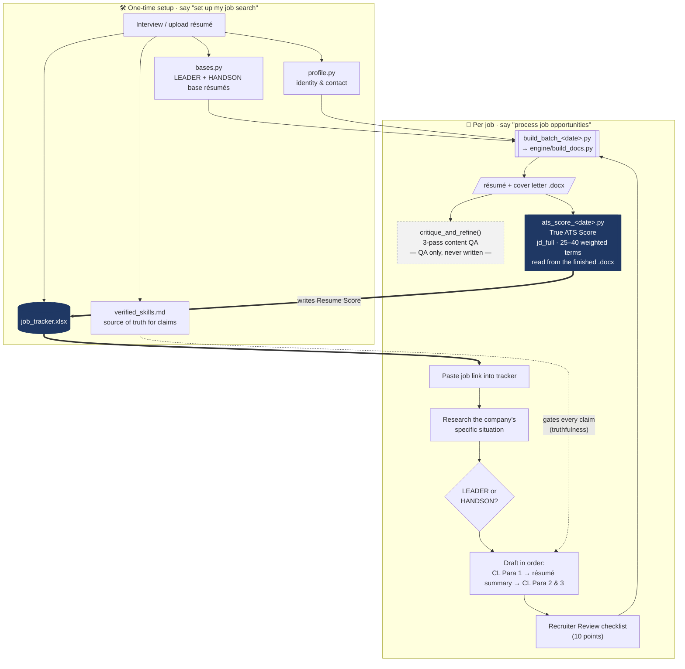

# Job Search Tailor

A Cowork plugin that turns a job posting into a tailored résumé + cover letter
and scores how well your résumé actually matches the role — with a **realistic
ATS score, not an inflated 100**.

It encodes a recruiter's playbook: a 6-second-scan résumé, a three-move cover
letter, a 3-pass content review, and a separate, honest ATS scorer.

## What you get

Two skills:

- **setup-profile** — a one-time interview that builds *your* two base résumés, a
  verified-skills file (so applications never fabricate experience), and a job
  tracker. Say *"set up my job search."*
- **process-opportunities** — the daily loop. Paste job links into the tracker,
  then say *"process job opportunities."* It tailors a résumé + cover letter for
  each, runs the 3-pass review, and writes a True ATS score per job.

## Two ideas that make it work

1. **Truthfulness.** Your `verified_skills.md` is the source of truth. Nothing
   gets claimed unless it's there. Portfolio-only skills are always labeled as
   such. Genuine gaps are acknowledged with a counterweight, never invented.
2. **Honest scoring.** The number in your tracker is the **True ATS Score** —
   computed from the real job description (25-40 weighted terms) read from the
   finished document, *including* the requirements you don't meet. A strong fit
   lands in the high 80s/90s; a partial fit lands in the 70s. A flat 100 means
   the term list was too soft. The keyword-checklist used during drafting is
   QA only and is never written to the tracker.

## Process flow

Two phases: a **one-time setup** that builds your reusable assets, then a
**per-job loop** you run for every opportunity. The two invariants are baked into
the flow — `verified_skills.md` gates every claim, and the tracker's *Resume
Score* is written **only** by the ATS script (the content-QA score never is).



**Reading the diagram:** the dark path (`ats_score` → `job_tracker.xlsx`) is the
only thing that writes the *Resume Score*. The dashed `critique_and_refine` box is
a drafting aid whose checklist score is deliberately a dead end. Everything you
claim must trace back to `verified_skills.md`.

## Quick start

1. Install the plugin.
2. *"Set up my job search"* → answer the interview (or upload your résumé).
3. Paste a few job links into `job_tracker.xlsx` (Company, Role, Date, URL).
4. *"Process job opportunities"* → get tailored documents + honest scores.

## How it's organized

```
engine/build_docs.py         the builder + reviewer (no personal data)
profile/                     YOUR data: profile.py, bases.py, verified_skills.md
                             (the *.example.* files show the shape)
templates/                   per-run build + ATS scripts, and the tracker
references/process_rules.md   the full playbook (read by the skills)
skills/                      setup-profile, process-opportunities
```

Your working folder (created during setup) mirrors this: `engine/`, `profile/`,
`scripts/`, and `job_tracker.xlsx`, with finished `.docx` files in the root.

## Notes

- Job descriptions are read with the browser (works with LinkedIn, Indeed, etc.),
  or you can paste them in. No special connector required.
- Document generation uses `python-docx` and `openpyxl` (installed on demand).
- It's deliberately opinionated about résumé/cover-letter craft — that's the point.
